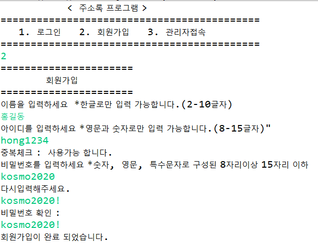
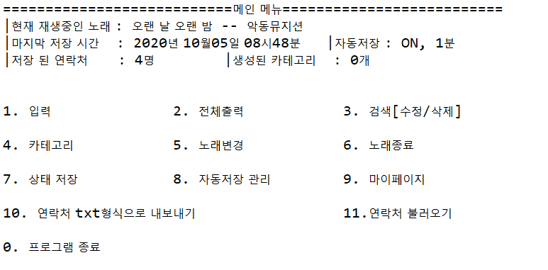
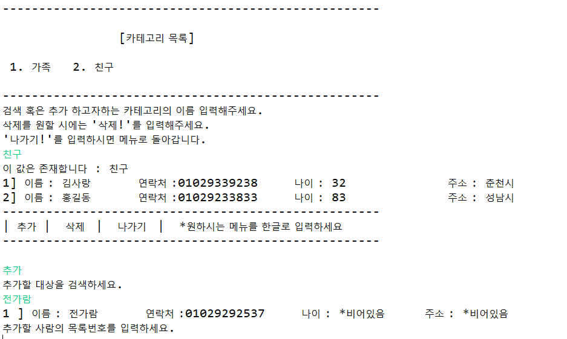
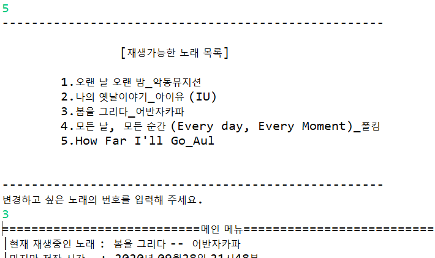
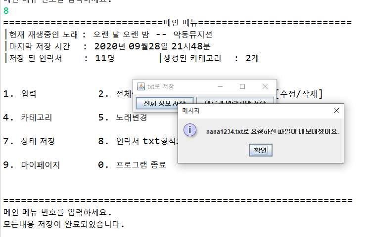

# AddressBook

프로그래밍 공부 초창기 약 1달째에 만든 자바 주소록 프로젝트.  
기본적인 주소 추가, 저장, 삭제를 포함한 회원가입, 노래재생, 카테고리, 자동저장, 연락처 txt로 내보내기 및 가져오기 등의 기능을 구현하였다. 회원가입은 싱글톤패턴을 사용하였고, 노래재생에는 스레드 기능을 사용하는 등 미숙하더라도 다양한 기술을 사용해보며 기초를 다지는 것에 목적을 둔 프로젝트였다.  
:trophy: **1차 개인프로젝트 2등!**
# 실행화면 이미지

__1. 로그인 및 회원가입__   
     
   
__2. 메인화면__  
     
   
__3. 연락처 CRUD__   
     
   
__4. 카테고리__    
     
   
__5. 노래재생__    
     
   
__6. 연락처 txt로 내보내기__    
     
   
